ref: https://github.com/Criheacy/Deep-Learning-Notes

>李宏毅老师的「[机器学习与深度学习](https://www.bilibili.com/video/BV1JE411g7XF)」课程笔记 by Criheacy
>
>1. SDU 深度学习课老师发的 PPT 有些就来自李宏毅老师的课件，所以讲的内容基本一样~~（但是个人觉得不如李宏毅老师讲得好）~~；不过视频课程比较长，实际复习（或者速成）的时候挑考试重点 2 倍速看即可
>2. 我们当时是甘甜老师的课，不用担心挂（考试后注：2021 年的题前面的选择和分析题跟去年题一模一样；后面的简答是自动驾驶，问的都是一些「怎么收集数据集」「分析一下误差出在哪里」这种问题；比较难的题大多出在同学讲的论文里的模型（ResNet、YOLO 这些），还有一些迁移学习里的概念（finetune 之类的）；然而我看了半天的 Attention 什么的都没考）
>3. 笔记记的主要是速成的内容，可以用来快速过一遍；有些地方可能理解稍有偏差建议以视频为主
>4. [MIT License](./LICENSE)

### Bias 和 Variance

同一个模型对于不同的训练数据集可以训练出多个不同的参数集合，这些带参模型之间的差异叫做 Variance，它们的 mean 与理想模型的差叫做 Bias 。

当模型函数越复杂，能够表示的函数集合也就越多，针对不同的训练数据就更有可能出现训练数据上的过拟合，从而每一组之间就可能千差万别，从而 Variance 较大；但因为函数集合很大可能涵盖了理想模型，所以当训练数据足够多时各个模型的期望就更贴近理想模型，从而 Bias 较小。而当模型越简单，能够表示的函数集合有限，出现过拟合的可能性不大， Variance 较小；但同样因为函数集合有限，很可能涵盖不了理想模型，无论怎样拟合都与理想模型有一定差距，从而 Bias 较大。

减小 Variance 的方法：

- 增加训练数据（很有效但往往难以实现）
- 引入 Regression 用于惩罚太过复杂的函数，避免过拟合

减小 Bias 的方法：

- 重新设计模型，考虑更多更复杂的因素

### Regression

在 Loss function 后面加一个正则项，用于减弱**过拟合**，提高模型的泛化能力。假设原函数是 $f(x)=wx+b$ 的形式，那么正则项为 $\lambda \sum{(w_i)^2}$ 。$\lambda$ 是一个手动调节的超参；当 $w$ 这个参数越大（可以理解为原函数越复杂），则加入 Loss 中的惩罚因子越大。这可能会影响 bias ，不过在处理 variance 过大的情况效果较好。

### Loss Function

Loss function 为损失函数，负责评价一个函数的好坏，并且应该具有连续可微的性质以便给出原函数的调整策略。Loss function 有以下几种：

1. Mean Squared Error （MSE，均方误差）
   顾名思义，即每个训练集上的样本真实值与预测值先差再平方最后取平均（均方误差倒过来就是计算步骤）。属于比较简单的一种算法，常用在各种机器学习模型里（比如最简单的 $y=wx+b$ 线性回归）

   > 不过 MSE 有一个显著的缺点：在处理**分类问题**中，一般分类的依据都是函数的输出是一个 N 维向量对应 N 个类别，向量里的哪个分量最大就取哪个类（最大似然估计）。而当分类错误时， MSE 对函数的惩罚仅限于一个二次项，这是远远不够的（对比后面介绍的交叉熵损失（ Cross Entropy，CE ）会直接趋向于无穷大，二者的对比见下图）。
   > 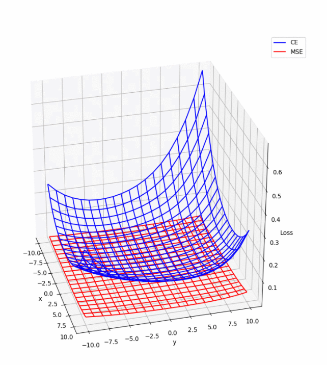
   >
   > 这个问题当使用 Sigmoid 或 Softmax 作为激活函数时尤其明显。因为函数得到的数值要经过激活函数处理，而这两个函数得到的结果在接近 0 和 1 时的偏导数值很小（如下图）。而刚开始训练的模型经过激活函数的输出都会集中在 0 和 1 附近，配合 MSE 时会出现会出现学习速率极其缓慢，也被称为「梯度消失」。解决「梯度消失」的方法就是更换 Cross Entropy 作为 Loss function 。
   >
   > 

2. Classification Error （分类误差，或分类错误率）
   因为在分类任务中不适合使用均方误差（因为会惩罚「过于正确」的样本， Classification 节会提到），所以这里采用二值来统计**被分类错误的样本占总样本数的百分比**，称其为 Classification Error。计算起来比 MSE 还简单，适用于分类任务。

3. Cross Entropy Loss Function （交叉熵损失）
   $$
   \begin{array}{l}
   	L_i & = & \sum_c^M\sigma(\hat{y_i}=c)\log(P(\hat{y_i}=c)) \\
   	L & = & \sum_i
   \end{array}
   $$
   其中 $L_i$ 是对于训练数据中单独一个样本产生的交叉熵损失，总的交叉熵损失 $L$ 即为把所有样本的加起来。 $M$ 是类别数量， $\sigma$ 为一个符号函数，当 $\hat{y_i}=c$ 即对第 i 个样本的预测类别正确时

   比如在一个图像分类任务里面，

### Gradiant Descent

Gradiant Descent 的步骤很简单不提了，以下为几个小 Tips：

#### Adaptive Learning Rate

顾名思义，不同于传统的 Learning rate 值为常数的情况，这里的 Learning Rate 是可变的，会随着学习过程动态适应。

- Adagrad：思想是考虑 Gradiant 的导数，也就是原函数的二阶导，从而决定学习的「加速度」。实际情况下，计算二阶导并不容易，所以这里采取了一种近似估计，通过计算过去所有梯度的平均值来估计二阶导的绝对值数值大小（还有一种理解方法认为它更关注函数的「突然变化」，如果这一次变化的函数值比以往的都要小，那可能是快接近终点了， Adagrad 就会以更慢的速度靠近）。实际公式如下：
    $$
    \begin{array}{cc}
        w^{t+1} &\leftarrow& w^t - \frac{\eta^t}{\sigma^t}g^t \\
        \eta^t & = & \frac{\eta}{\sqrt{t+1}} \\
        \sigma^t & = & \sqrt{\frac{1}{t+1}\sum^t_{i=0}(g_i)^2}
    \end{array}
    $$
    其中 $\eta$ 是一个随时间逐渐变小的参数，而 $\sigma^t$ 是以前求出来所有的 Gradiant 的 Root Mean Square （平方均值，英文从右往左就是计算步骤，先 Square 再 Mean 最后 Root ，注意 Mean 取的是 t+1 因为要避免第一次 t=0 的情况）

- Root Mean Square Property（RMSProp）：是在 Adagrad 基础上的优化，加入了一个全局学习率因子，从而修正了连续梯度下降中的摆动，使得梯度下降路径基本沿一条直线，方向上不会有太大的变化，提高了学习速度
  
- Adam ：这是目前应用最广泛的一种算法。结合了 RMSProp 和 Adagrad 的精髓，大致思想是把 Gradiant Descent 看作一个小人下山的过程，每次更新当前位置的操作看成物理学意义上的位移，并计算在这个过程中的「动量」。注意到物理学上位移并不是直接由赋予速度造成的，而是对一个质点施加一个力的作用产生加速度，所以速度不会有突变；同理在小人下山的过程中也不应该有太过突然的变化，应该保持一种「惯性」：它考虑过去一段时间内的运动情况，在原有运动方向上加入新 Gradiant 的修正，从而得到新的位置。

	- 具体计算时，它会在算出过去的运动情况后乘以一个小于 1 的因子，下一次计算位置时直接使用这个因子加上新的值再乘以一个因子，这就会使越早的运动对现在的影响越小，比较符合直觉。
	
	> 这个理解就好，应该不会考公式；公式太难了大家都背不过，要挂大家一起挂 

#### Stochastic Gradiant Descent

一种加速 Gradiant Descent 的方法。以往计算 Loss function 时都是对所有的训练样本计算 Loss 之后求 Mean ，而 Stochastic Gradiant Descent 是每计算一个训练样本就根据当前值的 Loss 走一小步，有多少个训练样本就可以走多少步，从而大大加快 Descent 的速度。

#### Feature Scaling

如果给定的 $x$ 是向量有多个指标（ $x_1,x_2\cdots$ ），而这些指标之间的数量级差别很大（例如 $x_1$ 都是 1，2，3 这样的个位数，而 $x_2$ 都是 100，200，300 这个数量级的），那么可以对它们分别做变换，使得它们的 $\mu=0$ 且 $\sigma=1$ ，具体变换方程如下：
$$
x^r_i \leftarrow \frac{x^r_i+\mu_i}{\sigma_i}
$$
为什么 Gradiant Descent 之前要做 Feature Scaling ？根本原因是：椭圆上的法线并不指向椭圆的圆心，最开始进行 Gradiant Descent 的方向会有偏差，从而浪费步数。

#### Gradiant Descent 的缺陷

理想情况下会停在 Gradiant 等于 0 的位置，但这个位置并不一定是全局最优点，有可能是 Local minimum，还有可能只是「高原」上的一个点。

当前在 Linear Regression 中的 Loss function 是 convex 的（直译叫做「凸函数」），所以只存在一个 Local minimum ，同时这也是全局的最优点，所以当前不存在这个问题。

这个问题在后续解决方法，一是调整合适的学习率，二是采用前面说的各种优化方法，有一个比较经典的优化叫 Adam ，采用了一种类似 monument 动量的思想，储存了沿梯度下降过程中的「惯性」。

### Classification

$$
f(x)=Class: R
$$

首先： Classification 不能硬当作 Regression 来做，因为模型预测的输出会是实数域的，而我们期待的输出可能只有有限的几个数字（比如 0 和 1 ），所以它把「太过于正确」的值视为有害的而调整模型，从而得到不准确的 Boundary。因此模型和 Loss function 都需要调整，模型可以设定为「当某个值满足一定条件时分为某一类」的形式， Loss function 可以设定为「在训练集上分类错误的次数」，从而得到较好的结果。

==后面的概率模型还没看==

### Neural Network

### Activation Function

激活函数是在每一个网络层输出前额外增加的一个一元函数，目的是让整体函数变得非线性化（如果不加入 Activation function ，则整个网络结构实际上可以表示为一个线性函数式，这就失去了构造多层神经网络的意义）；同时也有借鉴生物学的因素，生物上神经信号不是线性的，而是有明显的「激活」与「未激活」两种状态。

通常采用 Sigmoid ，在多层网络中也有采用 ReLU 、 Maxout ，在分类任务中常用 Softmax 。

### Back Propagation

Back Propagation （反向传播）本质只是一种比较高效地计算 Gradiant Descent 的方法。因为在复杂的神经网络模型中，函数的参数有成千上万个，对于每个来单独计算偏微分十分复杂，所以引出 Back Propagation 。

#### Chain Rule

实际上就是高中就学过的链式求导法则，公式如下：

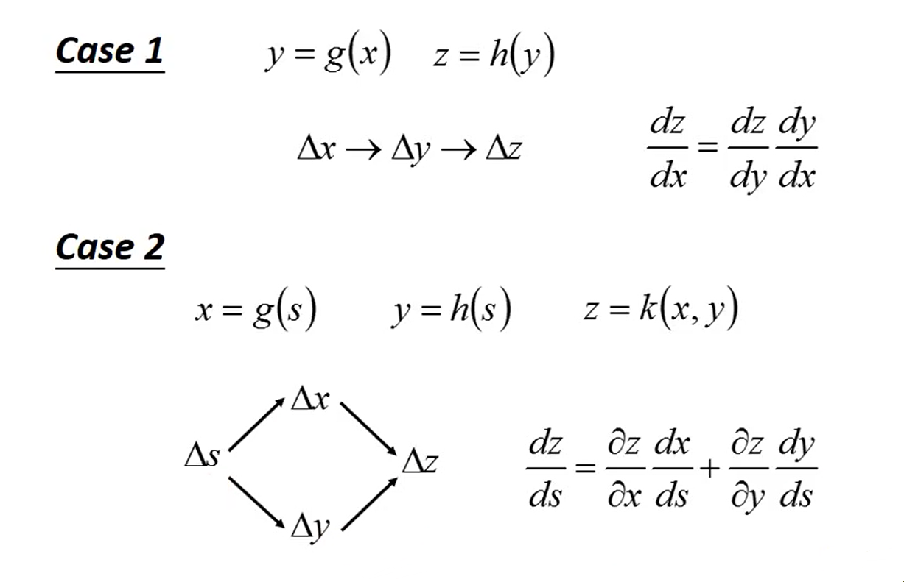

神经网络的构造形式很类似： 
$$
z=w_1x_1+w_2x_2+w_3x_3\cdots +w_nx_n+b \\
c=A(z)
$$
其中 $A$ 表示激活函数，可能是 softmax 、 ReLU 之类的。

#### Forward Pass 与 Backward Pass

类比一下线性回归中的 Gradiant Descent 的方法，我们想让 Loss function 最小，所以我们要对 Loss function 求导找出它的变化规律；而要想改变 Loss function 的值，我们只能通过调整网络中的 $w$ 等这些参数来改变：所以我们实际上要求的是 Loss function 的值（以下简写作 L ）对参数 $w$ 的偏导数 $\frac{\partial L}{\partial w}$ 。

因为在一个神经元中，正向传播计算结果可以看作两步：第一步是由上一层的输入 $\vec{a_1}$ 乘上 $\vec{w}$ ，得到 $\vec{z}$ ；然后 $\vec{z}$ 经过 Activation function 激活函数输出结果 $\vec{a_2}$ 进入下一层。

由此， $\frac{\partial L}{\partial w}$ 可以拆成两部分： $\frac{\partial L}{\partial w} = \frac{\partial z}{\partial w}\cdot\frac{\partial L}{\partial z}$ 。

- 其中前一项 $\frac{\partial z}{\partial w}$ 即为当前这层网络的输入 $\vec{a}$ （ $\vec{z} = \vec{a}\vec{w}$ ， $\frac{\partial z}{\partial w}= \vec{a}$ ）；
- 而后一项 $\frac{\partial L}{\partial z} = \frac{\partial a}{\partial z}\cdot\frac{\partial L}{\partial a}$ ： $\frac{\partial a}{\partial z}$ 是激活函数的导数，知道激活函数就能知道这个值；而 $\vec{a}$ 不仅是这一层的输出，还是下一层的输入，所以可以看作 $\frac{\partial L}{\partial a'}$ ，而这又可以拆为 $\frac{\partial L}{\partial a'} = \frac{\partial z}{\partial a'}\cdot\frac{\partial L}{\partial z'}$ （注意这是 L 对 a 求偏导，而不是 L 对 w ）， $\frac{\partial z}{\partial a'}$ 显然等于下一层的 $\vec{w'}$ ，而 $\frac{\partial L}{\partial z'}$ 又可以视为激活函数的导数乘以下下层的输入……直到某一层就是输出层，这一层的输出结果 $\vec{z}$ 将直接决定模型的输出 $\hat{y}$ ，通过 $\hat{y}$ 与 $y$ 真实值比较得到 Loss function，即 $L=f(\hat{y}, y)$ 。所以这一层的 $\frac{\partial L}{\partial z} = \frac{\partial \hat{y}}{\partial z}\cdot\frac{\partial L}{\partial \hat{y}}$ ： $\frac{\partial \hat{y}}{\partial z}$ 还是激活函数的导数，后一项是 Loss function 对输入结果的偏导数，这两项都已知可求。

所以这两部分也对应着不同的算法：

- 前一项需要知道的信息就只有当前这层网络的输入 $\vec{a}$ ，而这需要前一层网络输出得到；要得到前一层网络的输出，就需要给定前前一层网络的输出来计算，直到第一层的输入直接是训练集的样本 $\vec{x}$ 。这是一个从前向后的过程，称为 **Forward Pass** 。
- 后一项要知道的信息，除了 Activation function 和 Loss function 这两个常量（确定了采用哪种激活函数哪种损失函数之后接着可以算出来，而且常见的激活和损失函数都被设计的导数十分简单易求），还有就是 L 对 每一项输出的偏导。根据上述分析，这个偏导需要用到后一项的偏导，而后一项又用到后后一项，直到最后一层的输出是两个常数项相乘。这是一个从后向前的过程，称为 **Backward Pass** 。

Back Propagation 算法就是由 Forward Pass 和 Backward Pass 两部分组成。

### Model Improvement

在 Training set 上结果不好可能因为：

- 网络架构设计不合理 $\Rightarrow$ 重新设计网络结构（换用更复杂的模型）

  - 网络层数太多，导致前面的 Derivative 很小，每次更新对前几层几乎没有影响，最终网络前几层参数几乎都是随机数，而后几层参数优化已经接近饱和（再怎么更新也没法更进一步优化结果）。这被称为「梯度消失」

    > 为什么会出现这种现象？往往是激活函数的问题
    >
    > 直观上来看，「梯度（或者叫偏导数）」反映了改变这个参数会对最终的结果（ Loss function ）产生多大的影响。而 Sigmoid 激活函数的出现会削弱这种影响，并且每经过一层都会削弱一次，导致层层衰减，最后偏导数已经小到几乎为 0 。
    >
    > 
    >
    > 那么解决的方法自然就从激活函数入手。介绍几种不会出现「梯度消失」的 Activation function
    >
    > - ReLU（Rectified Linear Unit）：小于 0 的输入归零，大于 0 的输入不变
    >   - Leaky ReLU ：小于 0 的输入缩小 100 倍后输出，大于 0 不变
    >   - Parametric ReLU ：小于 0 的输入乘以 $\alpha$ 后输出（ $\alpha$ 是一个模型学习得到的参数值），大于 0 不变
    > - Maxout ：对每一层输入的参数预先分组，每一组中只取最大的输出（类似 Pooling 池化）
    >   - Maxout 可以实现 ReLU 的效果

  - 激活函数设置不合理 $\Rightarrow$ 重新设计激活函数

- 只收缩到了 Local minimum $\Rightarrow$ 采用 Adaptive Learning Rate ，例如 Adam

  - 实际上不用太过于担心 Local minimum 的问题，在大多数碰到的模型中都只会有唯一的 Minimum 。可以这样解释：出现 Local minimum 只可能是函数的每一维在这个点都出现「山谷」，而成千上万维的网络模型中每一维都出现的概率是非常低的，所以大可以不用太担心

在 Training set 上结果不错，但在 Testing set 上结果不好可能因为：

- Overfitting 过拟合 $\Rightarrow$ 减弱过拟合
  - 加入正则项 Regularization
  
    - 类似前面机器学习上的 Regularization ，这里也可以类似的加入正则项以避免模型太过复杂。一般采用参数的 L2-norm ，即对于参数集 $\theta=\{w_1, w_2, \cdots, w_n\}$ ，正则项 $\norm{\theta}_2=(w_1)^2+(w_2)^2+\cdots+(w_n)^2$ ；注意这里也不要加偏移项项 $b$ 
  
      > 注： L1-norm 即曼哈顿距离， L2-norm 即欧几里得距离
  
    调整减少训练轮数
  
    - 一般情况下，随着训练轮数的增加， Training set 上的 Loss 是在逐步减小的；但我们要找到是能使 Testing set 上的 Loss 最小的训练轮数并停在这里；这里往右会过拟合，往左会欠拟合。但是我们不知道真正 Testing set 的分布，也不能拿 Testing set 来筛选模型；我们能做的只有在 Training  set 上额外切出一部分来做 Validation set ，模拟 Testing set 的分布情况，从而避免过拟合的发生。这里也可以使用 Cross validation （交叉验证）等方法。
      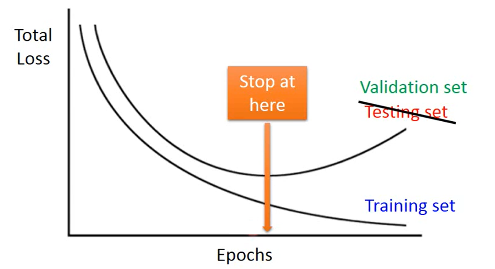
  
  - 重新设计简单的模型
  
- 设置 Dropout

  - 操作过程：
    - 在 Training 时，每个节点有 $p\%$ 的几率被「丢掉（ Dropout ）」。被「丢掉」的节点失去作用，同时所有于它相连的边也会失去作用，这导致整个模型变轻。
    - 在 Testing 时，不进行任何「丢掉」操作；同时每个节点得到的权重 weight 要乘以 $(1-p\%)$ 。
    
  - Dropout 仅适用于 Training 结果好而 Testing 结果不好的情况。加上 Dropout 会使 Training 时的结果变差，但是有可能会改善 Testing 时的结果。可以形象化地理解为「负重训练」，在训练的时候背上五公斤沙袋跑步，到比赛的时候卸下沙袋就能变得身轻如燕。
  
    > 这里李宏毅老师举的例子是，在做小组作业的时候如果大家一起做，经常会有滥竽充数的，大家都寄希望于别人能好好做而自己摆烂，最后就都完成不好；但是如果一个一个抽查，每次只挑选少数几个人来完成，那每个人都必须特别卷，要不就很容易被抓出来挂科。十分生动形象~
  
  - 如何理解 Testing 的时候每个节点的权重 weight 要乘以 $(1-p\%)$ ？也可以形象化地理解，当 $p\%$ 的节点被「丢掉」，而只有 $(1-p\%)$ 的节点起作用时，最后算出的结果是准确的，也就是说每个节点发挥了 $\frac{1}{(1-p\%)}$ 的作用。当 Testing 的时候，所有节点都在工作，那么所有节点加在一起，最后结果的期望就是 $1\times\frac{1}{(1-p\%)} = \frac{1}{(1-p\%)}$ 。为了让这个结果回归到 1 ，就需要乘以 $(1-p\%)$ ，从而得到要为每个节点的权重 weight 乘以 $(1-p\%)$ 。这样理解可能有些漏洞，但是大致就是这个意思。

### Convolutional Neural Network

卷积操作比较简单， CV 课上也学过，就不说了。

模型的结构一般是 Input $\rightarrow$ Convolution（卷积） $\rightarrow$ Pooling（池化） $\rightarrow$ Convolution（卷积） $\rightarrow$ Pooling（池化） $\rightarrow$ $\cdots$（可能会重复好多次） $\rightarrow$ Activation Function $\rightarrow$ Output 。

卷积常用于处理图像识别问题。

> 为什么图像识别问题要用卷积神经网络？除了众所周知的图像的输入参数多、图像存在降低分辨率后信息损失很小等因素以外，还有一条我自己的理解：
>
> 注意到图像中包含的一些 Pattern 不一定处在图像的哪个位置。比如一张图片上有一朵花，但是花出现在左上角也叫花，出现在正中间也叫花，怎么把这些情况都纳入模型的考虑范围？如果换做一般的网络架构，可能会针对左上角设置一个检测花的神经元，针对中间设置一个神经元，针对各个位置都有检测花的神经元，这就会让训练过程非常麻烦，同时网络也会有浪费（因为逻辑上存在冗余的节点）。而 CNN 则不同，可以理解为卷积核上就隐含了一朵花的模板，在卷积的过程中，这个蒙版会在**整个图像可能的位置都扫一遍**，如果在某个位置上出现了与模板匹配度很高的区域，那就会在卷积的输出结果层中输出一个比较大的值，从而在 Pooling 过程中被凸显出来，达到「辨识」的目的。而这就恰好利用了卷积运算的特性，使用一个卷积神经元就完成了任意位置的 Pattern 的识别。

**注意**：在经过第一次卷积后，比如有 20 个卷积核，那就会得到 20 张卷积后的图像，池化后还是 20 张图像；那下一层假如说有 30 个卷积核，会对上一层的每个图象都做卷积运算，最后得到 20×30=600 张图像吗？答案是否定的。**上一层的卷积图像数量将作为下一层的通道数，而一个卷积核会对考虑所有的通道，最后加权并得到一个数。**例如最开始是 3 个通道（ RGB ），经过 20 个卷积核的卷积运算，得到一张有 20 个通道的图片；在第二层的卷积运算中， 30 个卷积核每个卷积核在做运算时都会考虑到上一层输入图像中的 20 个通道，每次卷积运算都将这 20 个通道合起来考虑并得到一个数值；最终得到一张有 30 个通道的图片。可以参考下图中的向量大小变化。==这里的运算过程我还没完全搞明白。有三维的向量如何与卷积核做卷积运算？难道卷积核也是三维的吗？==
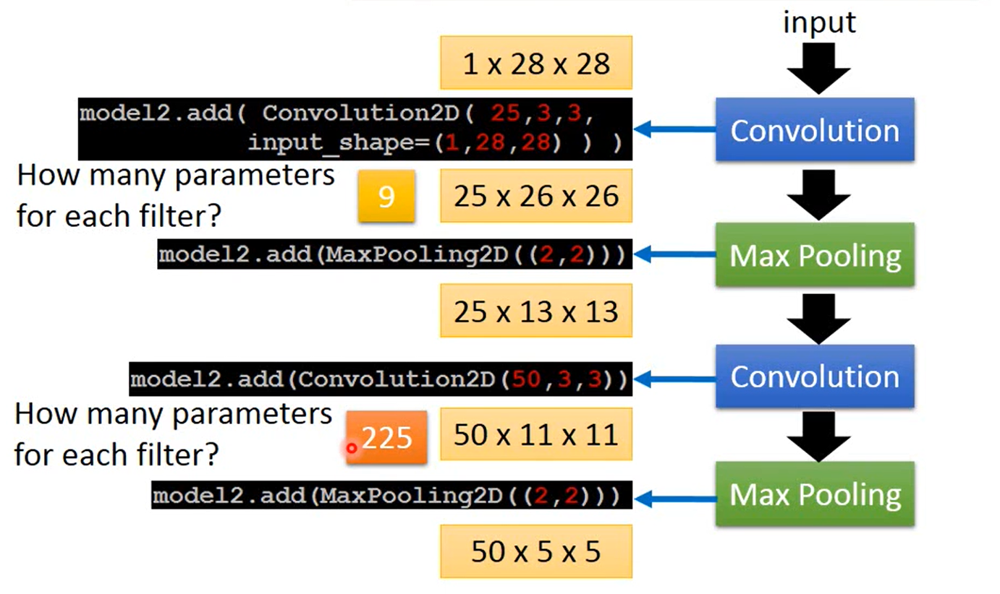

CNN 可以看成是特化过的 Fully Connected Network ，详见下图：
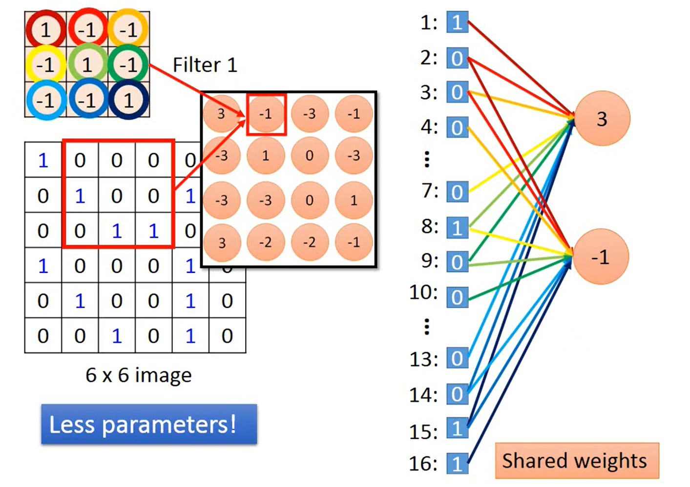

#### Pooling

池化过程类似前面讲的 Maxout 激活函数，是在卷积操作后将矩阵分为一个个小块，取每个小块中最大的值作为输出，其它的值丢弃。这一步实际上就是 CNN 里的 Activation function ，作用也是使函数更复杂，得到一个非线性的函数。

#### Flatten

扁平化（或者形象地翻译为「拉直」）就是把整个三维的矩阵转化为一个一维的向量，把矩阵中的所有数按行按列按通道平铺开。有的 CNN 架构在进行完若干层的卷积和池化运算后需要再接入全连接网络，就需要先经过这一步的处理。

#### What does CNN see ?

原本的训练目标可以理解为：给定固定的输入，中间函数以**输入**和**模型的参数**为参数，输出图片的特征（比如分类或打分）。模型函数的输出值可能与真实的分类（也就是预标注好的样本）有差距，我们就要计算差距对**模型的参数**的偏导数，从而调整模型参数来降低差距；这个「差距」也就是训练过程中设定的 Loss function 。

现在我们做一些调整。我们取出一个已经训练好的 CNN 中的某个 hidden layer ，它其中可能有成百上千个卷积核，我们想知道这个卷积核代表了什么，机器是怎么通过这个卷积核去提取图片中的特征的。我们固定模型的参数，去做模型在这个卷积核上的输出对**输入**的偏导数，从而调整输入使得这个卷积核上的输出最大。

> 实际做出来的效果十分离谱，跟人类的想象大相径庭。人类根本理解不了机器是怎么想得，它为什么能够完成这个任务。所谓「 CNN is easy to be fooled 」。加上了一个正则项（相当于人类手动筛掉一些不合理的）之后结果会好一些，能隐隐约约看出个轮廓。

这种思想还可以被应用在别处。有一种叫做 Deep Dream 的研究，就是给定一张输入图片到一个训练好的 CNN 里， CNN 会通过卷积运算输出一个向量。我们增大这个向量的值（比如给它乘以一个大于 1 的系数，让它正数更大负数更小），然后用 Back Propagation 求什么样的输入能输出这个增大后的向量。这一过程即让机器「强化」它所看到的，让它在画面上增加一些信息。

CNN 还可以用来做风格迁移。训练一个 CNN 网络，使它能够输出两个向量，分别是「内容」和「风格」。我们给定两张图 A 和 B ，记录下 A 图的「内容」和 B 图的「风格」，然后求一个输入能够同时输出 A 的「内容」和 B 图的「风格」，从而完成把 B 的风格迁移到 A 图上的效果。

除了图像分类任务以外，其实还有很多任务可以用到 CNN 。 CNN 还可以被用来下围棋，把一个局面看成一张图，下一步的落子位置作为输出，结合强化学习，就能训练一个下围棋的 AI 。有些语音辨识任务中也能用到 CNN ，可以把声音频谱看成输入图像，图像中包含某个模式，就可能使该模式中含有某一段特定的文字发音。

> 什么样的任务适合用 CNN 解决？最开始其实也说过， CNN 就是为了一些目标设计的：
>
> - 图像中有一些 Pattern ，并且这些 Pattern 是图像的一个子集（出现在图像的一小部分）
>   所以我们设计了卷积核和卷积运算来捕获这些 Pattern
> - 这些 Pattern 可能出现在图像的各个区域
>
> 当然针对有些新的任务， CNN 中的一些结构还有特别的解释。比如下围棋的 Max Pooling 会在各个选点中取价值最大的，可以解释为围棋中的「大局观」。

### Recurrent Neural Network

Recurrent Neural Network（RNN）循环神经网络，即「有记忆」的神经网络：为「联系上下文」设计的网络结构。例如给定一个序列作为输入（比如一个句子），句子中的每个词是什么和它所在的环境共同决定了它的含义。

模型的结构相比普通的网络，输入层不仅由当前输入决定，还收集了上一个特征的输出作参考，代表「上下文」：
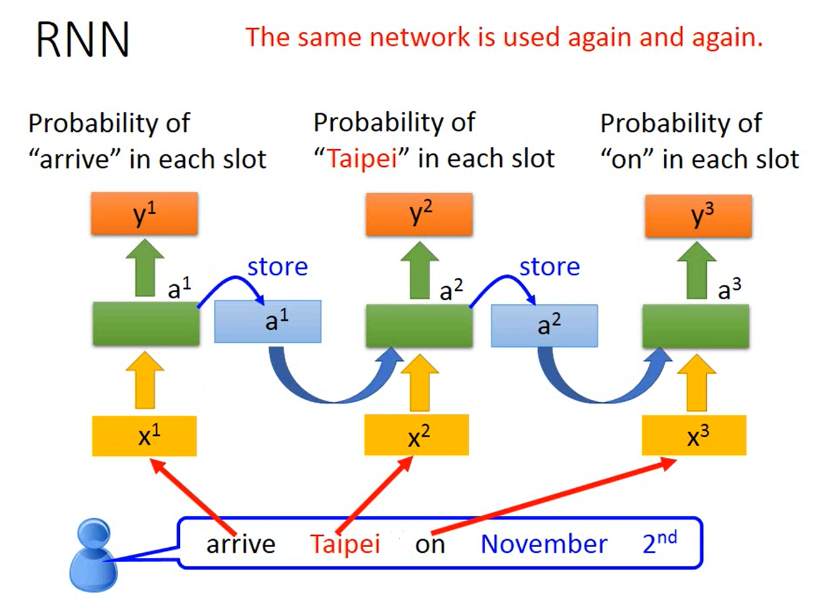

当然模型中传递的可以不只是输入层，每一层都可以向下传递：
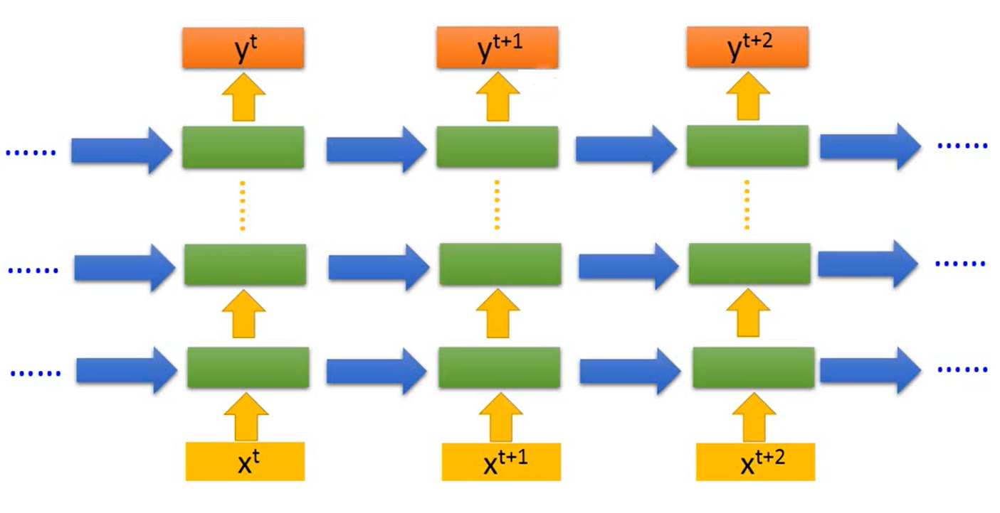
当输入不止由「上文」决定，也由「下文」决定时，还可以设计双向的 RNN ：
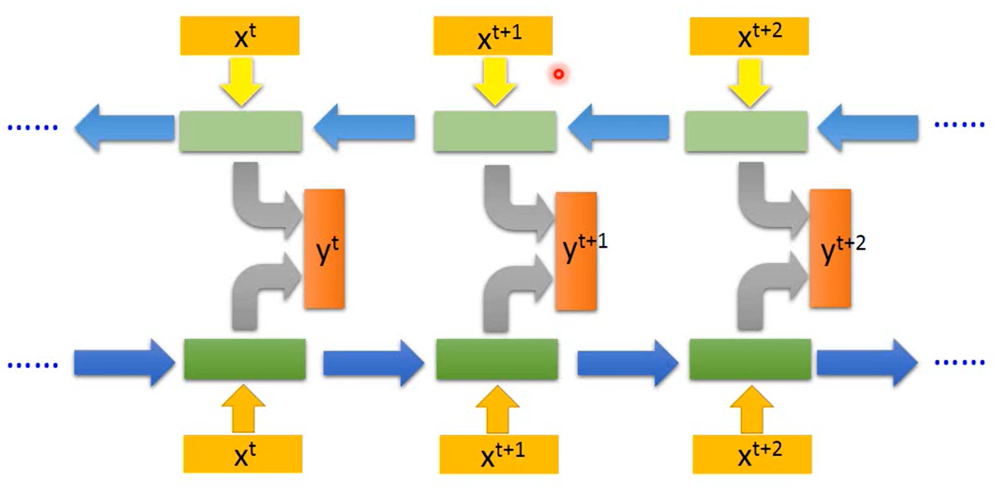

#### Long Short-Term Memory

> 字面翻译，应该是比较长的短时记忆（本质上还是 Short-Term Memory ，只是相比其它的比较长而已）

这是 RNN 的一种，同时也是 RNN 比较标准的做法（现在说一个模型是 RNN ，一般意义下都是 LSTM 实现的）。它的每个神经元有点类似一个独立工作的细胞或者什么小电路之类，核心是一个 Cell 来储存信息，并受到 Input Gate, Output Gate 和 Forget Gate 控制。其中 Input Gate 是输入与 Cell 之间的闸门， Output Gate 则是 Cell 与输出之间的闸门， Forget Gate 单独连接在 Cell 上，让 Cell 会「忘掉」之前的记忆。单个节点的结构如下图：
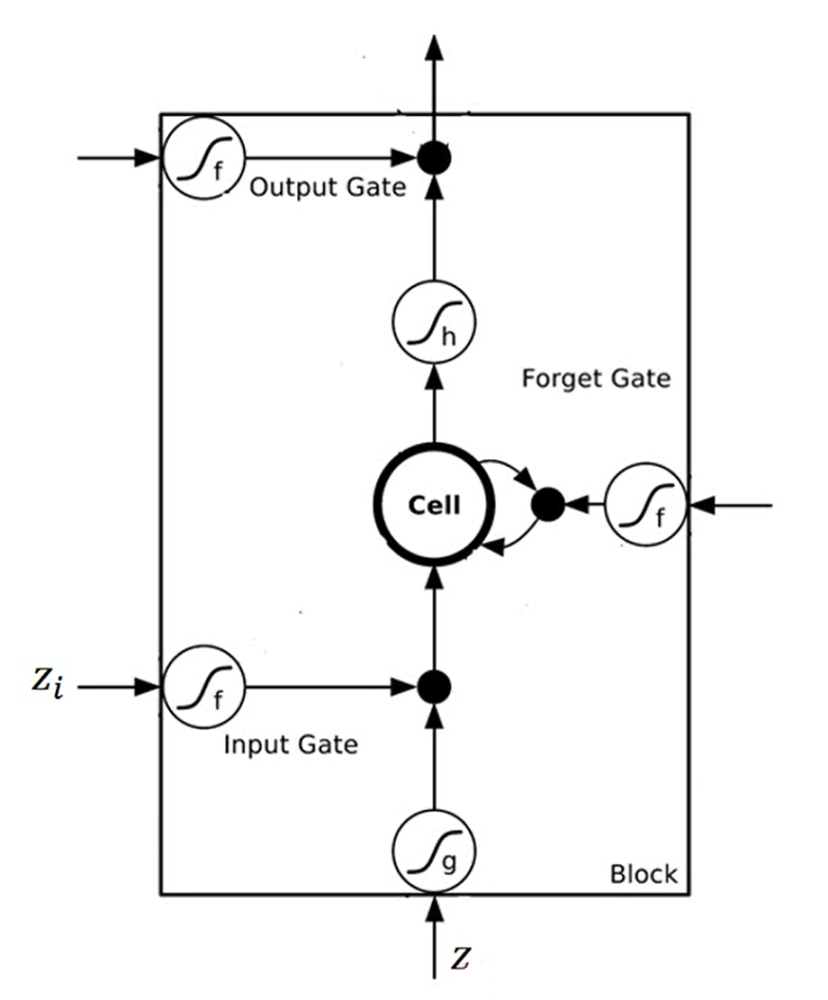

下图是它按照 RNN 的思想的画法，其中 $c^{t-1}$ 和 $c^t$ 就相当于 RNN 中的「上一次节点的输出」和「下一次节点的输入」。
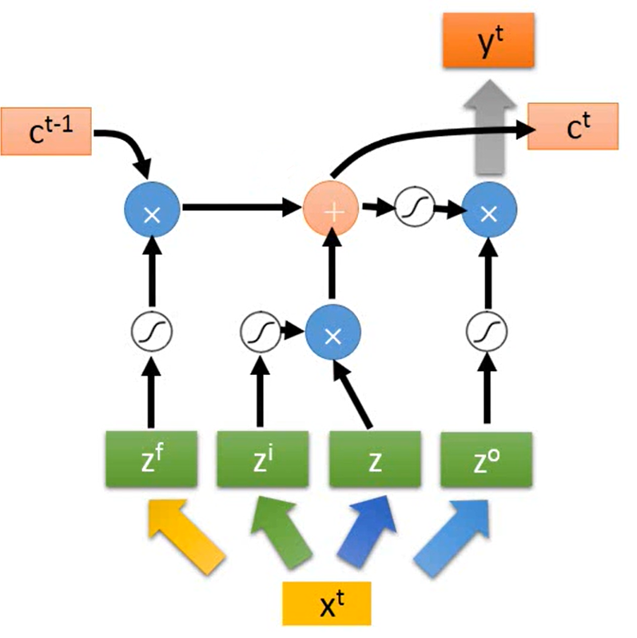

一般的 LSTM 结构中，输出的逻辑门会先对输入进行 $wx+b$ （ weight 和 bias ）的运算，再放入 Sigmoid 函数中，从而保证输出在 0 ~ 1 之间。举例而言，假设 $x_2$ （ x 向量中的第二个分量）决定输入和输出， $x_3$ 决定遗忘，那么输入门和输出门中的 $w_2$ 是正数且 $b$ 是负值；遗忘门中的 $w_3$ 是负数且 $b$ 是正值。这里的 $b$ 代表「默认情况下」，一般 LSTM 中输入和输出门总是关闭的（代表不接受输入也不输出），且遗忘门总是打开的（代表**不会遗忘**，会一直记得其中的内容），只有当输入向量的分量足够大能够改变默认值时才会改变门的状态。

#### Gradiant Vanishing

RNN 在实际训练过程中与普通的神经网络有很大不同，它的 Loss function 非常陡峭，且梯度分布不均匀。它的 Loss function 经常出现「悬崖」，一不小心碰到悬崖立即会因为梯度过大而飞出去：
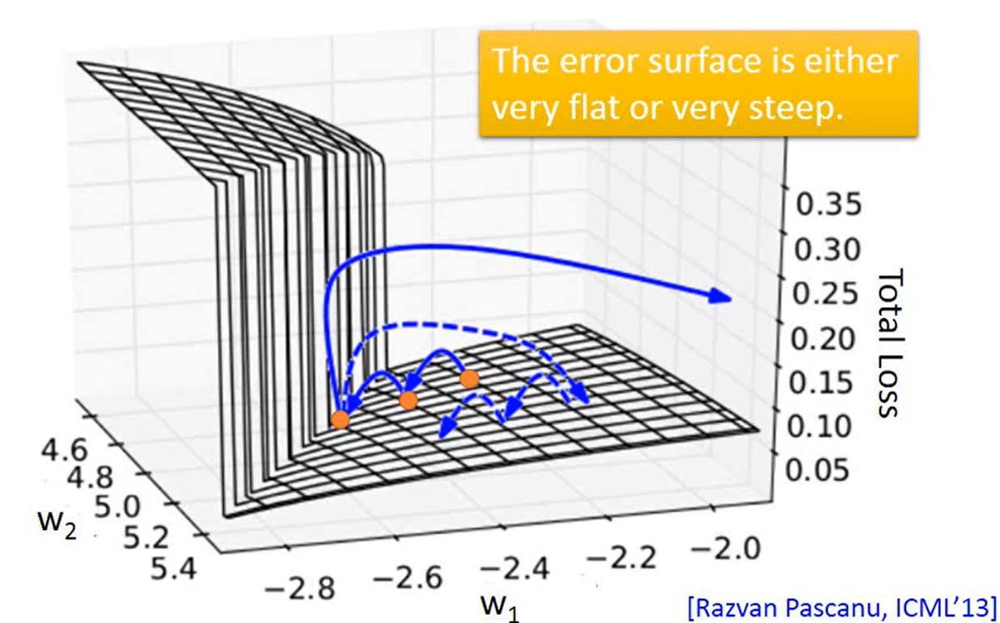

究其原因，可能是这里的 Back Propagation 不是普通的反向传播算法，而是 Back Propagation Through Time（ BPTT ）；直观上的理解是由于 RNN 的性质，一个节点输出的值不会再传递到下下个节点，所以改变了它对后面也没什么影响，这就导致了「梯度消失」的问题。

传统 RNN 中一个比较好的解决方法是为 Gradiant 加入「 Clipping 」，即当 Gradiant 太大时让它取最大值（比如 $G=\min(G, G_{max})$）。而另一种方法就是引入 LSTM 取代传统的 RNN （可以说这就是 LSTM 发明的原因），它可以有效解决 RNN 中梯度消失的问题（不是梯度爆炸，有些地方仍然会出现悬崖，不过不会出现平原），因为只要 Forget Gate 不关闭， LSTM 会长期记住输入值，从而持续性地对模型产生影响；而一般情况下 Forget Gate 很少关闭（全关闭那还用 RNN 干嘛），所以它就保证了梯度会一直存在。

#### Gated Recurrent Unit

一种比 LSTM 简单的网络结构，思想跟 LSTM 差不多，区别在于没有单独设置 Forget Gate ，而是用 Input Gate 同时控制输出和遗忘，大概意思是「旧的不去新的不来」。跑起来效果跟 LSTM 差不多；而且它参数比 LSTM 少，所以出现过拟合问题时可以考虑用它替换。

#### Many to 1

输入一段序列，输出单独的一个评分或分类。在 RNN 后面将每个输出接入一个 Fully Connection 之类的网络，得到最终结果。

#### Many to Less

输入一段序列，输出比输入短的另一段序列。方法与传统的 RNN 差不多，只是在输出的时候多一个可选的分类，表示为「空」。这种方法叫 Connectionist Temporal Classification（CTC）。

#### Many to Many

输入和输出都是一段序列，并且长度不一定（比如经典的机器翻译问题）。一般的方法是让 RNN 模型先一个一个吃掉所有输入，然后让它吐出输出，并且把上一次的输出作为输入从而获得下一个输出的值。与 Many to Less 相同，这里的输出也需要多一个可选的分类来表示「空」。因为这里需要先吃掉所有的输入，再一口气全部输出，所以输入部分又被称为 Encoder ，输出部分称为 Decoder ，这也就是著名的 Encoder-Decoder 架构。

### Generative Adversarial Network

Generative Adversarial Network（GAN）即生成-对抗网络，它包含 Generator 生成网络和 Discriminator 辨别网络两个结构，生成网络负责生成一个尽可能逼真的输出，而辨别网络负责辨别给定样本的真假。它们两个负责的工作相「冲突」（就像捕食者和猎物），生成得越像就会让辨别起来更困难，而辨别得越准确就会让模仿生成更困难。同时训练它们二者，通过这种机器自己与自己的博弈训练可以同时得到一个模仿得很像的生成网络和一个有着火眼金睛辨别能力很强的对抗网络。

#### Generator

输入随机一个向量，输出一张生成的对象（可能是一句话、一首诗、一幅图片等等）。输入的向量可以是从 Gaussian 分布中随便取的，相当于随机种子，从而控制不同的输出内容。

最基础的 Generative Network 只能做到生成的对象符合一些要求，但没法做到通过输入来控制输出。比如我想让机器写一首「婉约派」的诗词，我不知道该输入什么向量才能让它的输出符合我的要求。所以我们在原有基础上改进模型，即 Conditional Generative Network 。

> Generator 从数学上说本质是在模仿训练样本集中的分布规律。因为训练样本集中的分布很难用某个确定的数学公式来表述（比如「诗词」对应的词向量都符合哪些特征实际上很难显式地表示出来），所以我们构造了一个能够将低维的、容易表示的分布（就是用于输入的随机变量的分布）映射为高维的难以表示的分布（就是要模仿的分布）的函数，这就是 Generator 。

#### Discriminator

输入一个对象（与 Generator 的输出对应），输出一个数值，代表对象的「质量」。这个输出数值越大代表给定的对象越像是真的，越小代表越像是假的。

#### How to train?

1. 训练 Discriminator：从一个随机分布函数中取若干个向量，输入固定的 Generator 中，得到若干张图片；再去训练样本中的若干张图片，二者一起放入 Discriminator 中；设定合适的 Loss function 使得对于 Generator 生成的图片得分越接近 0 越好，而训练集中取出的图片得分越接近 1 越好，以此做 Gradiant Descent 优化 Discriminator 中的参数。
2. 训练 Generator：固定 Discriminator，从随机分布函数中取若干个向量输入 Generator 中，并将输出直接送入 Discriminator 中，设定合适的 Loss function 使得对于每一个输入 Discriminator 的打分越接近 1 越好（**注意：这里 Discriminator 并不是 0 **，这不是 Discriminator 的训练过程，而是经过一定次数训练后的 Discriminator 根据自己训练所获得的分类技巧对输入图片打出的分数），以此做 Gradiant Descent 来优化 Generator 中的参数。

实际过程中这两步会交替进行（但不是同时）。

#### Can Generator learn by itself?

如果不需要 Discriminator ， Generator 实际上有一种自己学习的方法：把每个训练样本都标注一个输入向量，然后把输入向量当作模型的输入，用 Gradiant Descent 的方法让模型的输出尽可能贴近训练样本（本质上像是一个反过来的分类器）。值得注意的是，如果每个训练样本被标注的向量都是随机生成的，这个网络的训练可能很困难，取得的效果也并不好，因为可能会有两张完全不同图片被标注为差不多一样的输入向量，机器就很难从输入中获取规律；所以可能还需要一个 Auto-Encoder 来生成每张图片的标注向量。

> 这里的 Auto-Encoder 来自 Encoder-Decoder 架构， Encoder 接受一张图片作为输入，而 Decoder 把 Encoder 结果作为输入，期待它能够还原回原图片。这两个模型是同时训练的，而且实际上 Decoder 就是我们这里要找的 Generator 。

#### Can Discriminator generate?

实际上可以用类似前面说过 CNN 的反向生成的方法，固定 Discriminator 的参数，求 Loss function 对输入的偏导数，从而调整输入以获得最小的 Loss 。

这种方法一般不用来直接做生成，而是作为 Discriminator 的自我调节：因为 Generator 是存在局限性的，比如一个 GAN 网络用来生成猫的图片，训练得到的 Generator 发现猫需要有两个尖尖的耳朵和长胡子，而 Discriminator 也就用「耳朵尖不尖」和「胡子长不长」这两个指标来区分真实图片和伪造图片，但实际上给定一张尖耳朵长胡子的狐狸的图片，Discriminator 也会认为这是猫。因为 Generator 从来没有考虑过可以从狐狸这个方向骗过 Discriminator ， Discriminator 也从来没有得到这方面的训练，所以在实际应用中就会出错。解决方法就是让 Discriminator 自己生成图片，然后把它自己输入的图片当作伪造图片与训练集的真实图片一同训练，从而消除 Generator 生成局限性的问题。

### Reinforcement Learning

在一些多次决策任务中（比如下围棋、打游戏、控制机器人等），我们很难去告诉机器每一步应该做什么，或者给每一次它的决策都设置一个评分规则，而在评价经过多次决策之后得到的最终结果是相对来说比较简单的。比如打游戏这一秒到底该不该释放这个技能，那一秒该向哪个方向前进，怎么决策都有道理，没有哪个能明确的说更好；但是经过这一步的释放技能、那一步的向前走等等一系列操作最终赢下了游戏，那么每一步的操作都是对「赢游戏」这个结果有贡献的。我们只需要告诉机器赢了比输了好（输赢的判断还是很容易的），而让机器自己去归纳哪一步是比较关键的一步，又是哪一步让我赢了游戏。

一般使用的是 Deep Reinforcement Learning （即有多层神经网络的 Reinforcement Learning ）。

#### The difficulties

- Reward delay
  比如下围棋经过几百步的博弈之后突然下了一颗子得到了一次奖励，机器就会认为这颗子特别关键；但是正是前面几百步的铺垫才会有这一步的结果，如何把 Reward 分配到以前的决策上是一个很重要的问题。

